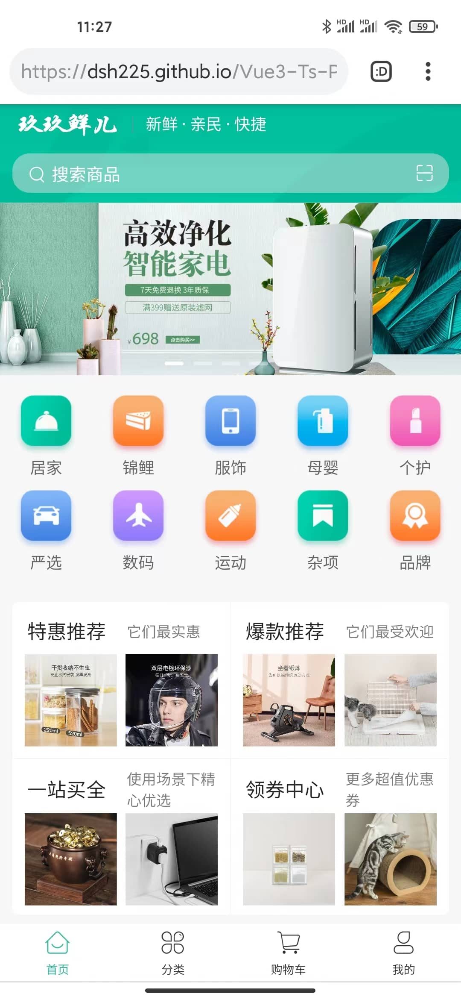

# Uniapp从入门到进阶

**lastUpdated: 2023-8-22**

## 前言

随着小程序的热度越来越高，小程序开发已经成为了前端工程师的必修课。与此同时出现了大量地小程序框架，像Wepy、Mpvue、Uniapp、Taro等等。在众多框架中我选择了Uniapp 进行开发，原因是Uniapp 是一个可以轻松实现一次开发多端的前端框架，可发布微信、百度、支付宝、头条的各小程序，还有安卓和 ios 应用。

如果你也想独立开发小程序？或者是开发一款 app？苦于没有经验，对小程序，或者 Vue 一无了解的你，肯定想掌握一门拿的出手的手艺。想着提升自己，扩充自己，现在这本课程一直想找的，不用太多经验，也不用有大牛的技术，你就可以看到一个小程序，一个 App 是怎么开发的。跟我来吧，从基础到实战，通过 **Vue3+Ts+Pinia+uni-app** 技术开发实现一个商城项目。
### 欢迎在线体验[build:h5](https://David-TechNomad.github.io/Vue3-Ts-Pinia-uni-app/)

<a href="https://David-TechNomad.github.io/Vue3-Ts-Pinia-uni-app/">

</a>

### 欢迎在线体验build:mp-weixin


## 你会学到什么？
从理论到实战，涵盖Vue和Uniapp各个层面的知识和技巧；
循序渐进的讲解，前端新人也能看懂学会；
贴近企业的项目，完全按着企业级代码标准和工程开发的流程进行授课；
代码、基础、项目流程、工作技巧，多维度提升，让你全方面提高工作能力；
## 适宜人群
熟悉 HTML、CSS、JS ( ES6 ) 及前端工程化
小程序新手、想快速了解Uniapp开发的童鞋
## 你需要准备？
一台折腾得起的电脑
一颗肯行动的心

## 为什么你必须学Uniapp开发
当今社会互联网技术在不断的极速发展，其中离不开每一位热情奋进的技术人员。每天层出不穷的新概念，热火朝天的区块链，泛滥的共享经济，每年蜂拥而至抢着每一手热点发布的手机厂商，还有资讯快餐充斥着我们所有能看到的场景。这一切都离不开界面的呈现，内容上、形式上、功能上都在以非同凡响的效果吸引着你我，当中离不开一个角色--前端。

前端是从web应用开发分离出来的用户层，也就是用户接口，直接与用户进行交互，通信技术发展促进了很多前端技术的变革。从最传统的开发模式开始，随着的前后端分离，AMD，CMD和UMD的模块化管理，工程化出现和发展，再演变为前端MVVM和当今的小程序。前端与其说是一个职业，更是一项不断学习提升自我的过程，作为前端开发者堪比盖世武侠，招式固然重要，唯有内功心法才能让功力大增。

2017 年，微信小程序横空出世，依托微信的强大市场占有量，小程序的出现影响了人们的生活，简单方便的移动操作界面应用在生活方方面面，但是对于前端开发者来说，意味着我们又要掌握一套的框架，甚至又催生了一个职业—小程序工程师。

> 小程序是一种不需要下载安装即可使用的应用，它实现了应用“触手可及”的梦想，用户扫一扫或者搜一下即可打开应用。也体现了“用完即走”的理念，用户不用关心是否安装太多应用的问题。应用将无处不在，随时可用，但又无需安装卸载。

开发市场规模不断扩大，前端开发的角色越发重要。对于大部分应用级开发而言，开发团队的人员配备正向前端倾斜，包括Android开发、iOS开发、PC端开发、小程序开发等角色进一步壮大了前端开发团队，前端工程师的岗位权重占比将不断加重。

虽然开发应用一直在向前端倾斜过渡，作为一名小小的前端，是不是也敢挺着身板自称程序员呢？因为前端就三大法宝：HTML、JS、CSS。技术，显然站不住脚。前端三架马车React、Angular、Vue 这样面向现代 web 应用需求的前端框架及其生态，与APP结合的混合开发模式，内嵌单页webview，Hybrid App。都在混淆这前端界。这些让我们感觉渺小羸弱。

你是否也在考虑WEB统一的时代来临，更或是由你改变？如果你有这样的想法，那么你来对了，Uniapp正在做这些事情，让开发有着统一的规范。

> Uniapp 是一个使用 Vue.js 开发跨平台应用的前端框架。开发者通过编写 Vue.js 代码，Uniapp 将其编译到iOS、Android、H5、以及各种小程序平台。

在实际开发中，同一个项目可能需要分别在H5 端，小程序端，甚至React Native 端有相同的表现，我们就需要开发和维护多端不同代码，工作量是非常巨大的。Uniapp 继承自 Vue.js，提供了完整的 Vue.js 开发体验。Uniapp 组件规范和扩展api与微信小程序基本相同。有一定 Vue.js 和微信小程序开发经验的开发者可快速上手，用特定的集成语言与多端语言进行对话就能在多个平台发布，省去了开发成本，节约了时间，何乐而不为呢？

曾在网上看到一句，“程序界的「二八定律」，百分之八十的问题可以运用百分之二十的知识来解决，而剩下的百分之二十的问题需要运用百分之八十的知识来解决。准备好那百分之八十的知识，才会在遇到有挑战的问题时更加游刃有余，机会永远留给准备好的人。”

我不是你的老师，只是你的一个旅伴而已。你问我路在何方，我指向我俩的前方。
## 工具介绍、新建项目及插件配置
> 软件开发的时间通常是这样的：一开始的 90% 开发工作用掉了整个计划 90% 的时间，剩下的 10% 同样需要整个计划 90% 的时间，而最终发布前的修改也是如此。—— 汤姆 · 嘉吉
当你看到这里，相信你已经做好了准备（一台折腾得起的电脑和一颗肯行动的心），准备跟着我一同进入 Uniapp 的世界。

正所谓工欲善其事，必先利其器（这句话我经常说:>），我们要开发微信小程序和app，有两个工具是必不可少的：

1. 微信开发者工具
2. HbuilderX

注意：配置与安装方法 windows 系统一致。

### 微信开发者工具
我们要做的应用需要编译成小程序，因此也要[下载微信开发者工具](https://developers.weixin.qq.com/miniprogram/dev/devtools/download.html)进行编译预览效果。


找到对应版本，下载安装，完成打开


这里先做个配置，找到菜单 【设置】 >> 【安全设置】，该配置可以使 Uniapp 使用命令行调用微信开发者工具，实现项目的预览与热更新。


把服务端口选择开启即可


这里如果不开启，接下来的调试会报以下错


### HbuilderX
打开 [HbuilderX官方](https://www.dcloud.io/hbuilderx.html)，使用 Uniapp 框架开发项目搭配官方的编辑器 HBuilderX 开发，编辑器集成了node，添加了很多底层配置。无需复杂的安装，开箱即用并且搭配了可视化界面，可以轻松编辑。


下载对应安装包（我的是 Mac 机），下载选择一个 App 开发版本（App 开发版已集成相关插件、开箱即用），下载成功后直接解压：


一顿操作后找到这个图标打开，打开基本上可以达到秒开。


如果你熟悉了其他大众化的编译器，完全可以无缝衔接过来，因为可以快捷键切换，这样还是同样的配方，熟悉的味道，不用再次学习。打开编译器，空白区域可看快捷键方案设置，点击选择即可。


然后修改主题 【工具】>>【主题】>>【酷黑】，即可看到熟悉的 IDE 的界面。


新建项目
【选择新建项目】 >> 【uni-app】 >> 【默认模板】 >> 【创建】；选择 uni-app(U) 创建项目是为了开发者编写一套代码，可发布到iOS、Android、H5、以及各种小程序。


一秒创建成功


目录结构：

* pages 业务页面文件存放的目录
* static 静态文件目录(images之类)
* App.vue App 全局应用配置
* main.js 初始化入口文件
* manifest.json 多端配置信息
* pages.json 配置页面路由、导航等信息，类似原生小程序的 app.json
### 插件配置
选择菜单 【工具】 >> 【插件安装】


建议安装这些：

* NPM
* 内置浏览器
* 内置终端
* App真机运行
* uni-app编译
* Git插件
* js-beautify
* prettier
* htmlhint
* stylelint
* eslint-plugin-vue
* eslint-js
* js压缩
* css压缩
* scss/sass编译
* es6编译
其余根据自己需要安装。

### 运行 Uniapp 项目
上面的配置插件完成之后，就可以小试一下刚才的项目了，运行 Uniapp 项目主要有3种方式：

* 浏览器
* 小程序
* 手机 App

由于手机预览调试操作介绍内容比较长，我们会在后面章节小程序、app 调试环境配置中展开细说。这里简单说一下浏览器预览。

HBuilder 可能检测不到的浏览器所在位置，所有的运行配置都需要对应上你在本机安装的浏览器的安装路径才能进行命令行启动预览。小程序，手机的运行配置一致。
选择菜单【工具】>>【设置】>>【运行配置】：


完成 chrome 等浏览器运行配置，操作 【运行】>>【运行到浏览器】>>【chrome】，HBuilder 会在底部开启终端，实行项目更新与热编译的检测：


### FAQ
有人会说，官方文档写得足够详细了，为什么还要看你的呢？官方文档更像一份新华字典，大而全，可以反复查阅，而我的章节更像一份干货小结，来源于项目用于项目。

### 小结
磨刀不误砍柴工，只有刀磨锋利，接下来才会更顺手。
## Uniapp基础知识
> 软件就像做爱。一次犯错，你需要用余下一生来维护支持。—— Michael Sinz

本章我们来学习 Vue 基础，认识 Vue 开发。

为什么是了解 Vue 基础呢？因为 Uniapp 设计的开发标准是：Vue的语法 + 小程序的API + 条件编译扩展平台个性化能力。了解完 Vue 基本开发原理就可使用 Uniapp 了。

### 什么是 MVC 与 MVVM ？
在开始之前，我们先来了解什么是 MVC 与 MVVM ？才能一步一步深入了解 Vue 框架的出现和 Vue 可以解决的问题。

MVC 的定义：MVC 是 Model-View-Controller 的简写。即模型-视图-控制器。


* 模型（Model）指的是后端传递的数据（比如数据库记录列表）。
* 视图（View）指的是所看到的页面，显示数据（数据记录）。
* 控制器（Controller）是应用程序中处理用户交互的部分，处理输入（写入数据库记录）。

在前端并不成熟的时期，很多业务逻辑是在后端实现的，MVC 允许在不改变视图的情况下改变视图对用户输入的响应方式，用户对视图的操作交给了 Controller 处理，在 Controller 中响应 View 的事件调用 Model 的接口对数据进行操作，一旦 Model 发生变化便通知相关视图进行更新。

这里只是简略的去说 MVC ，感兴趣的小伙伴可以去网上查一下关于这方面的知识。使用 MVC 的目的就是将 Model 和 View 的代码分离。MVC 是单向通信。也就是 View 跟 Model，必须通过 Controller 来承上启下。但是 MVC 中大量的 DOM 操作又加上视图的二次加载更新，用户看到的更新数据页面会慢一些，并且页面渲染性能降低，影响了用户体验。

为解决这样的问题，MVVM 就出现了。

在过去的10年中，我们已经把很多传统的服务端代码放到了浏览器中，这样就产生了成千上万行的 javascript 代码，它们连接了各式各样的 HTML 和 CSS 文件，但缺乏正规的组织形式，这也就是为什么越来越多的开发者使用 javascript 框架。比如：Angular、React、Vue。浏览器的兼容性问题已经不再是前端的阻碍。前端的项目越来越大，项目的可维护性和扩展性、安全性等成了主要问题。当年为了解决浏览器兼容性问题，出现了很多类库，其中最典型的就是 jQuery。但是这类库没有实现对业务逻辑的分成，所以维护性和扩展性极差。

综合上面原因，才有了 MVVM 模式一类框架的出现，通过数据的双向绑定，极大了提高了开发效率。Vue 就是基于 MVVM 模式实现的一套框架。

下面来看一下 MVVM。

MVVM 是 Model-View-ViewModel 的简写，即模型-视图-视图模型。MVVM 模式是通过以下三个核心组件组成：


* 模型（Model）指的是后端传递的数据，包含了业务和验证逻辑的数据模型。
* 视图（View）指的是所看到的页面，定义屏幕中 View 的结构，布局和外观。
* 视图模型（ViewModel） 是 MVVM 模式的核心，它是连接 View 和 Model 的桥梁，帮忙处理 View 的全部业务逻辑。

ViewModel 的角色就是将视图与模型之间来回转化：

* 模型转化为视图：将服务器发送的数据转化成我们看到的页面内容。这就是 {{}} 进行数据对应的作用。
* 视图转化为模型：将所页面内容及用户操作信息转化成服务器的数据。这部分是指令与 dom 事件对应的作用。

视图与模型这两者之间的来回转化，我们称之为数据的双向绑定。

### 双向绑定的使用
来看一个添加名单的应用页面的 index.vue 结构，用户可以在输入框输入名字，书写的内容可以即时反映显示在文本中，用户可以操作添加，把该名字插入列表数据中：


在 Vue 中可以发现：

* Model：data 处存放的数据
* View：template 中 HTML 代码展示的视图
* ViewModel：是 methods 里的 JS 逻辑代码
如此一来，我们已经对 MVVM 有了初步的认识。


DOM 的数据通过 Vue 的 directives（指令）来改变，所以直接改变 model 的数据就可以直接将数据反映在 DOM 上面。前面的 v-model 指令就是用户在输入框操作时反映显示在视图中（你要添加的名字: newName ），所以我们使用 Vue 这样的框架时，想要改变视图样式不是直接像 jQuery 操作 DOM 一样去操作，而是改变数据，让数据的去驱动视图样式的改变。

### 生命周期
Vue 实例有一个完整的生命周期，也就是说从开始创建、初始化数据、编译模板、挂在DOM、渲染-更新-渲染、卸载等一系列过程。Vue 实例的生命周期钩子就是在某个阶段给你一个做某些处理的机会。比如 Vue 整个渲染完 DOM 的时候，你才可以操作 DOM，如果在 DOM 未渲染完之前去操作 DOM，由于 DOM 不存在而操作失败。

由于 Uniapp 是集成多端的，因此完整的支持 Vue 实例的生命周期，同时还支持应用生命周期及页面生命周期，区别在于你是开发 h5，小程序员，app。

应用生命周期

函数名|说明
:-|:-
onLaunch|	初始化完成时触发（全局只触发一次），例如：点击分享页面进入应用，可以捕获在分享链接的参数
onShow|	启动，或从后台进入前台显示
onHide|	从前台进入后台
onError|	报错时触发

页面生命周期
函数名|	说明
:-|:-
onLoad|	监听页面加载，每个页面触发一次，其参数为上个页面传递的数据，参数类型为Object（用于页面传参）
onShow|	监听页面显示。页面每次出现在屏幕上都触发，包括从下级页面点返回露出当前页面
onReady|	监听页面初次渲染完成。如果渲染速度快，会在页面进入动画完成前触发
onHide|	监听页面隐藏
onUnload|	监听页面卸载
onResize|	监听窗口尺寸变化
onPullDownRefresh|	监听下拉刷新
onReachBottom|	监听触底上拉加载
onShareAppMessage|	监听点击右上角分享
onPageScroll|	监听页面滚动
onBackPress|	监听左上角返回按钮或 android 返回键

以上的生命周期在项目中会经常使用到。看着挺多的不好记住，不要急，我将在进阶中详细演示，并提供一个页面模板给你使用。

### 模板语法
来一个简单的基于 HTML 的模板语法：
```Vue
<template>
    <view class="content">
        <view :title="singer">喜欢的歌手是: {{singer}}</view>
        <button @click="changeName">更换名字</button>
    </view>
</template>

<script>
    export default {
        data() {
            return {
                singer: '周杰伦',
            }
        },
        methods: {
            changeName () {
                this.singer = '张学友'
            }
        }
    }
</script>
```
Vue 数据绑定最常见的形式就是使用 Mustache 语法 (双大括号) 的文本插值，比如 singer，Mustache 标签将会被替代为对应数据对象上 singer 属性的值。无论何时，绑定的数据对象上 singer 属性发生了改变，插值处的内容都会更新，singer 会被渲染成 周杰伦。

Mustache 语法不能作用在 HTML 特性上，遇到这种情况应该使用 v-bind 指令：
```Javascript
<view v-bind:title="singer">喜欢的歌手是: singer</view>

// 渲染成
<view title="周杰伦">喜欢的歌手是: 周杰伦</view>
```
也可使用简写 v-bind 指令，将 v-bind:title="singer" 写成 :title="singer"，直接用 : 代替。

当然模板语法提供了完全的 JavaScript 表达式支持，你可以写一些简单的表达式，下面这些表达式会在所属 Vue 实例的数据作用域下作为 JavaScript 被解析：
```Javascript
{{ number + 1 }}

{{ ok ? 'YES' : 'NO' }}

{{ message.split('').reverse().join('') }}

<div v-bind:id="'list-' + id"></div>
```
### 事件
在上面的代码块中，有个 methods 对象，Vue 把所有的事件都放在 methods 属性中，对应具体的方法函数：
```Vue
<template>
    <view class="content">
        <view :title="singer">喜欢的歌手是: {{singer}}</view>
        <button @click="changeName">更换名字</button>
    </view>
</template>

<script>
    export default {
        data() {
            return {
                singer: '周杰伦',
            }
        },
        methods: {
            changeName () {
                this.singer = '张学友'
            }
        }
    }
</script>
```
这样的方式可以统一集中处理事件，并且开发者可以直观知道事件绑定在哪个元素中，比如 changeName 方法绑定在 button 中，如果想要解除事件直接删除就可，而不用担心别的元素隐形绑定该事件而导致报错。

### 计算属性
模板内的表达式非常便利，但是设计它们的初衷是用于简单运算的。在模板中放入太多的逻辑会让模板过重且难以维护。例如：
```Html
<div id="example">
  {{ message.split('').reverse().join('') }}
</div>
```
如果你在处理一个比较复杂的变量，那么在 {{}} 书写就不合适了，看到长长的代码都能让你头大。对于任何复杂逻辑，你都应当使用计算属性。
```Vue
<template>
    <view class="content">
        <view>喜欢的歌手是: {{singer}}</view>
        <view>喜欢的歌手是: {{computedSinger}}</view>
    </view>
</template>

<script>
    export default {
        data() {
            return {
                singer: '周杰伦',
            }
        },
        computed: {
            // 对singer二次加工处理
            computedSinger: function () {
              // `this` 指向 Vue 实例
              return this.singer.split('').reverse().join('')
            }
        },
        methods: {
            changeName () {
                this.singer = '张学友'
            }
        }
    }
</script>
```

结果：
```Html
喜欢的歌手是: 周杰伦
喜欢的歌手是: 伦杰周
```
### 指令
在 Vue 中指令是带有 v- 前缀的特殊属性，通过属性来操作元素。

常见的指令有：
```Vue
<template>
    <!-- v-text：在元素当中插入值 -->
    <view v-text='singer'></view>
    <!-- v-for：根据变量的值来循环渲染元素 -->
    <view v-for="(item, index) in list">
        {{item}}--{{index}}
    </view>
    <!-- v-if和v-else：根据表达式的真假值来动态插入和移除元素 -->
    <view v-if="isShow">我会显示</view>
    <view v-else>我不会显示，但是我要跟有 v-if 指令的元素并齐</view>
    <!-- v-model：把input的值和变量绑定了，实现了数据和视图的双向绑定 -->
    <input type="text" v-model="singer">
    <!-- v-bind：绑定元素的属性并执行相应的操作 -->
    <view v-bind:class="{t1: isBig}">isBig 为 true 时，该元素class类名会变为 t1</view>
    <!-- 上面v-bind可以简写 : -->
    <view :class="{t1: isBig}">isBig 为 true 时，该元素class类名会变为 t1</view>
    <!-- v-on：监听元素事件，并执行相应的操作 -->
    <view v-on:click="change">该元素绑定了点击事件</view>
    <!-- 上面 v-on：可以简写 @ -->
    <view @click="change">该元素绑定了点击事件</view>
</template>

<script>
    export default {
        data() {
            return {
                singer: '周杰伦',
                list:[1, 2, 3, 4],
                isShow: true,
                isBig: true

            }
        },
        methods: {
            change () {
                // ...
            }
        }
    }
</script>
```

template 和 block

Uniapp 支持在 template 模板中嵌套 template 和 block，用来进行 列表渲染 和 条件渲染。

template 和 block 并不是一个组件，它们仅仅是一个包装元素，不会在页面中做任何渲染，只接受控制属性。

代码示例:
```Vue
<template>
    <view>
        <template v-if="test">
            <view>test 为 true 时显示</view>
        </template>
        <template v-else>
            <view>test 为 false 时显示</view>
        </template>
    </view>
    
    <!-- 列表渲染 -->
    <block v-for="(item,index) in list" :key="index">
        <view>{{item}} - {{index}}</view>
    </block>
</template>
```
### 全局变量(状态管理)
在 Vue（Uniapp）中有多种处理全局变量，全局方法的做法：

1. 挂载 Vue.prototype
将一些使用频率较高的常量或者方法，直接扩展到 Vue.prototype 上，每个 Vue 对象都会“继承”下来。

注意这种方式只支持多个 Vue 页面或多个 nVue 页面之间公用，Vue 和 nVue 之间不公用。

示例如下：

在 main.js 中挂载属性/方法
```Javascript
Vue.prototype.websiteUrl = 'http://localhost:3000';
```  
然后在 pages/index/index.Vue 中调用
```Javascript
<script>  
    export default {  
        methods: {  
            getBanner() {
                uni.request({
                    url: this.websiteUrl + '/banner',
                    method: 'GET',
                    data: {},
                    success: res => {},
                    fail: () => {},
                    complete: () => {}
                });
            }
        }  
    }  
</script>
``` 
这种方式，只需要在 main.js 中定义好即可在每个页面中直接调用。但要注意的是，当前的this指向的是当前模块，稍微不注意就可能出现重复命名的情况。

建议在 Vue.prototype 上挂载的属性或方法，可以加一个统一的前缀$。比如$url 、$global_url这样，在阅读代码时也容易与当前页面的内容区分开。
```Javascript
// main.js
Vue.prototype.$websiteUrl = 'http://localhost:3000';  
```
```Javascript
// 访问
const url = this.$websiteUrl
```
使用 this.$websiteUrl 的时候，与你协作的开发人员一看 $ 开头就知道是全局扩展的属性。

那如果只是简单的变量呢？

2. globalData
如果你了解开发小程序的话，恭喜你，这个就是基于小程序延伸过来的。如果你还不熟悉，可以往下看

但从字面上来看 globalData 单词，可以翻译为全局变量。Uniapp 也把 globalData 作为一种比较简单的全局变量使用方式，但是有一点要清楚，globalData 走内存，storage 走缓存，即小程序退出 globalData 会清空，storage 则不会。

在 App.vue 可以定义 globalData ，也可以使用 API 读写这个值。
```Javascript
<script>  
    export default {  
        globalData: {  
           websiteUrl: 'http://localhost:3000'  
        },  
        onLaunch: function() {  
           console.log('App Launch')  
        } 
    }  
</script> 
```
js 中操作 globalData 的方式如下：
```Javascript
赋值：getApp().globalData.websiteUrl = 'http://localhost:3000'  

取值：console.log(getApp().globalData.websiteUrl) // 'http://localhost:3000'  
```
3. Vuex
Vuex 是一个专为 Vue.js 应用程序开发的状态管理模式。它采用集中式存储管理应用的所有组件的状态，并以相应的规则保证状态以一种可预测的方式发生变化。


关于Vuex东西不少，我打算开一章来详细讲解。

### 小结
1. MVVM 是解决 MVC 的一些问题而出现的。
2. Vue 是以数据驱动来改变视图的，所有的元素属性，文字节点，事件都可以进行管理；
3. 全局变量可以让你在项目中管理整个状态，类似使用"全局变量"。
## 基础组件、自定义组件、全局组件
> 程序有问题时不要担心。如果所有东西都没问题，你就失业了。
本章主要讲解组件与组件的使用。
### 什么是组件？
开篇我们先简单聊一下前端组件化。什么是组件化？在前端界，特别是现在 React，Vue，Angular 几大流行开发框架的盛行的时代下，已经把组件化的设计思想推向了一个新的高度了，出现了框架与组件共同繁荣的景象。

组件简单的来说就是可实现独立的功能的单一整体代码片段，无论把这个片段放在哪里，它还是保持着原有的功能和样式，从而可以实现复用，这种整体独立化的设计思想就是组件化，而这样设计出来的单一整体代码片段叫做组件。这样的设计可以非常灵活的使用在项目中，项目设计更具系统性，从而提高了项目管理开发效率。

如果上面说的比较拗口，来点简单的。比如一座房子，把房子看成一个独立的整体由屋顶、窗户、门，墙等组成。


用代码来表示就是：
```Vue
<template>
    <!-- 这是一个房子 -->
    <view>
        <!-- 屋顶 -->
        <roof></roof>
        <!-- 墙 -->
        <wall></wall>
        <!-- 窗户 -->
        <window></window>
        <!-- 门 -->
        <door></door>
    </view>
</template>
```
那么换成一个页面呢？一个完整的页面由页头，内容，页脚等组成：
```Vue
<template>
    <view>
        <!-- 页头 -->
        <page-header></page-header>
        <!-- 内容 -->
        <content></content>
        <!-- 页脚 -->
        <pager-footer></pager-footer>
    </view>
</template>
```
那我们在开发页面的时候，头部和尾部都是固定不变的，只要内容更改就行。在开发框架中，页面其实也是作为组件化的一部分，但是我们组件更多关注的是页面的每个部件，比如头部，内容区，弹出框甚至确认按钮都可以作为一个组件，每个组件有独立的HTML、css、js代码。

### 基础组件
Uniapp 根据多端的特性以 Vue 语法糖 + 小程序的 API 打造了一大批组件，这些组件在开发的时候以 HBuliderX 为 IDE，生产的时候把那些代码编译转换为各个平台特性的语法与 API。

Uniapp 框架根据组件的设计思想为我们设计提供了一系列的基础组件，我们可以通过组合这些基础组件进行快速开发。每一个基础组件都独立定义了样式与功能，
这些基础组件中比如 button 组件，你可以设置按钮的大小，文字样式，里面的回调时机，这个按钮组件具有独立的并且有完整的多样化功能，相当于我们以参数的形式去定义这个按钮。

Uniapp 基础组件分为以下八大类：

* 视图容器（View Container）
* 基础内容（Basic Content）
* 表单组件（Form）
* 导航（Navigation）
* 媒体组件（Media）
* 地图（Map）
* 画布（Canvas）
* webview（Web-view）

这些基础的组件可以让我们快速的开发项目，由于每个人都处理的业务功能都不一样，就需要根据自己的业务情况去定制一个组件。如果 Uniapp 基础组件没有你想要的组件，而你又需要一个代码片段来实现功能的复用，那么你可以根据组件规范来注册属于自己自定义的组件。

### 自定义组件
在数据绑定的三大框架 Angular、React、Vue 中，所有的元素都可以细分为一个组件，甚至是一个页面。这个组件可以重复的复用，组件的使用也造就了当今的前端的繁华的原因之一，当然现在使用的 Uniapp 也不例外，合成小程序，weex，h5 等的共有特性。

一个组件由三大部分组成：template 模板，js 数据交互和 css 样式层：
```Vue
<template>
    <view class="content">
       <image class="logo" src="/static/logo.png"></image>
       <button @tap="getMsg">{{title}}</button>
    </view>
</template>

<script>
    export default {
        // props 是从父级（引用当前组件）的变量占位，在当前组件下给这些变量一个初始化值（initValue）
        props:{
            title: {
                type: String,
                default: ''
            },
            list:{
                type: Array,
                default () {  // 这里返回值需要是一个函数
                    return []
                }
            }
        },
        data() {
            return {
                title: 'Hello'
            }
        },
        created() {

        },
        methods: {
            getMsg () {
                console.log('I am demo')
                this.$emit('getMsg', this)
            }
        }
    }
</script>

<style lang="scss">
    ...
</style>
```
可以看到上面主要由三个主要元素组成 template ， script ，style。

1. html 部分由 template 标签元素闭合组成，其余 view, image 元素遵循小程序的元素定义组成，需要注意的是组件元素必须有一个根元素（root element）包裹，不然会报错编译失败。

2. script 部分由 ES6 的 export default 导出整个页面模块，可以在其他页面引入该组件。

* props 是申明需要从父组件接收的数据

* data 数据部分是一个函数，返回该页面实例下的所有数据引用，data 必须声明为返回一个初始数据对象的函数；否则该组件关闭时，数据不会自动销毁，再次打开该组件时，会显示上次数据。
```Vue
//正确用法，使用函数返回对象
data() {
    return {
        title: 'Hello'
    }
}

//错误写法，会导致再次打开页面时，显示上次数据
data: {
    title: 'Hello'
}
```
props 中声明的数据与组件 data 函数 return 的数据主要区别就是 props 的来自父级，而 data 中的是组件自己的数据，作用域是组件本身，这两种数据都可以在模板 template 及计算属性 computed 和方法 methods 中使用。

* created 组件生命周期函数, 还有 beforeCreate , beforeMount 等生命周期与 Vue 标准组件的生命周期相同，但没有页面级的 onLoad 等生命周期。

* methods 是事件处理函数对象，包含整个页面交互及逻辑处理的函数。在上面例子中我定义了一个 tap 事件在 methods 中，当用户触碰（tap）的时候就会打印这个文字。

this.$emit('getMsg', this) 这一句是该组件通过 this.$emit() 派发事件，引用这个组件的地方可以利用 $on 对事件进行监听，实现参数的传递与事件向上传递，当前的 this 指的是该组件本身，指针指向当前组件。通俗的话就是，我传递一个叫 getMsg 事件并当前所有的参数内容出去，你只要在外面接收就可以了。

3. css 部分由 style 标签组成，这里面样式只作用当前的元素。style 支持 css3 标准，不用再写多余的 hack，比如 -webkit- 前缀等，已经由整个框架完成 hask 编译, 可以看到 style 标签有个 lang="scss",说明里面的样式表可以直接以 [scss](https://www.sass.hk/) 形式书写，当然 lang 的属性值还可以是 [less](http://lesscss.cn/),[stylus](https://stylus.com/)，找到合适自己的 css 预编译期可以事半功倍。

父子组件（组件引用者与组件）的关系可以总结为 props 向下传递，事件向上传递。父组件通过 props 给子组件下发数据，子组件通过事件给父组件发送消息。

注意：

1. 所有组件与属性名都是小写，单词之间以连字符-连接。
2. 根节点为 template，这个 template 下只能有一个根 view 组件。

Uniapp 并没有限制使用 HTML 标签，如果开发者写了 div 等标签，在编译到非 H5 平台时也会被编译器转换为 view 标签，类似的还有 span 转 text 、a 转 navigator 等，包括 css 里的元素选择器也会转。但为了管理方便、策略统一，新写代码时仍然建议使用 view 等组件。

### 自定义完成一个商品卡片组件


一个商品信息由商品图片，商品名称，商品价格，商品参考价组成。

实现步骤：

1. 建立组件模板。
　2. 准备组件的数据输入，定义 props 里面的数据、类型。
　3. 准备好组件的数据输出。即根据组件逻辑，做好要暴露出来的方法。
　4. 封装完成，进行命名调用。

在 components 文件夹创建 song.vue 文件:
```Vue
<template>
    <view class="song">
        <image class="img" :src="imgSrc"></image>
        <view class="desc">{{ title }}</view>
        <view class="flex-box">
            <view class="price">￥{{price}}</view>
            <view class="market-price">{{marketPrice}}</view>
        </view>
    </view>
</template>

<script>
export default {
    // 从父组件传值的
    props:{
        imgSrc: {
            type: String,
            default: ''
        },
        title: {
            type: String,
            default: ''
        },
        price: {
            type: String,
            default: ''
        },
        marketPrice: {
            type: String,
            default: ''
        },
    },
    data() {
        return {
            
        }
    },
    methods:{

    }
}
</script>
<style lang="scss" scoped>
.song {
    position: relative;
    width: 342rpx;
    height: 502rpx;
    line-height: 34rpx;
    color:#333;
    background:#fff;
    border-radius: 10rpx;
    overflow:hidden;
    font-size: 26rpx;
    .img {
        display: block;
        width: 342rpx;
        height: 342rpx;
        margin-bottom: 24rpx;
        background: #eee;
    }
    .desc {
        height: 64rpx;
        margin-top: 12rpx;
        line-height: 30rpx;
    }
    .price{
        color:#ff5000;
    }
    .market-price{
        padding-left: 10px;
        font-size: 24rpx;
        color: #979797;
        text-decoration: line-through;
    }
}
</style>
```
上面的组件的图片路径、商品名称、价格、市场价都经过 props 定义，只要在引用这个组件的页面里传值就行。

这样我们在首页 /pages/index.vue 就可以引用这个组件了
```Vue
<template>
    <view class="content">
        <song 
            :imgSrc="song.img"
            :title="song.title"
            :price="song.price"
            :marketPrice="song.marketPrice"
        />
    </view>
</template>

<script>
    import song from '../../components/song.vue'
    export default {
        components: {
            song
        },
        data() {
            return {
                song: {
                    img: 'http://gw.alicdn.com/bao/uploaded/i3/1917047079/O1CN01VlEDD522AEJzpw3A5_!!2-item_pic.png_360x10000.jpg',
                    title: 'Apple/苹果 iPhone 11 Pro',
                    price: '8699.00',
                    marketPrice: '￥8699.00',
                }
            }
        },
        onLoad() {
        },
        methods: {
            
        }
    }
</script>

<style>
page {
    background: #f2f2f2;
}
</style>
```
课程代码里面有列表数据循环，父子组件之间事件的传递的代码示例。

### 全局组件
Uniapp 支持配置全局组件，需在 main.js 里进行全局注册，注册后就可在所有页面里使用该组件。

但是
* Vue.component 的第一个参数必须是静态的字符串。
* nvue 页面暂不支持全局组件
(注：建议统一用按需页面引入组件)

main.js里进行全局导入和注册
```Vue
import Vue from 'vue'
import pageHead from './components/page-head.vue'
Vue.component('page-head', pageHead)
```
index.vue里可直接使用组件
```Vue
<template>
  <view>
    <page-head></page-head>
  </view>
</template>
```
### 非H5端不支持列表
Uniapp 只支持 Vue 单文件组件（ .vue 组件）。其他的诸如：动态组件，自定义 render 和 script type="text/x-template" 字符串模版等，在非 H5 端不支持。

* Slot（scoped 暂时还没做支持）
* 动态组件
* 异步组件
* inline-template
* X-Templates
* keep-alive
* transition （可使用 animation 或 CSS 动画替代）
* 老的非自定义组件编译模式不支持在组件引用时，在组件上定义 click 等原生事件、v-show（可用 v-if 代替）和 class style 等样式属性(例：card class="class-name" 样式是不会生效的)。建议更新为自定义组件模式。
* 老的非自定义组件编译模式组件里使用 slot 嵌套的其他组件时不支持 v-for。建议更新为自定义组件模式。

注意

在 Uniapp 中有些关键字做了保留，不可作为组件名，所以建议自定义组件时加上前缀，类似 xm-button。

### 小结
1. 组件是可实现独立的功能的单一整体代码片段，无论把这个片段放在哪里，它还是保持着原有的功能和样式，从而可以实现复用，这种整体独立化的设计思想就是组件化，而这样设计出来的单一整体代码片段叫做组件；
2. 如果框架的功能组件满足不了你，你就需要根据组件的规范自己定义一个组件；
3. 全局组件可以挂在到 Vue 实例中，作用在每一个页面文件上；
## 页面导航、网络请求、数据缓存
> 注释代码很像清洁你的厕所——你不想干，但如果你做了，这绝对会给你和你的客人带来更愉悦的体验。—— Ryan Campbell

这一章我们主要学习关于页面导航，网络请求以及数据缓存的知识，学习如何在跨页面中传递参数，如何拦截请求等

### 页面导航

说到页面导航，我们可能首先想到的是页面跳转（页面A跳转到页面B），页面跳转在不同端之间有不同的区别：

* H5 通过 window.history 属性对其进行访问，改变路由记录从而实现跳转
* ios/安卓 是改变根视图或操作导航控制器出栈进栈从而实现跳转
* 小程序实现跳转采用的方式也是改变根视图或操作导航控制器出栈进栈

如果你要把用 Uniapp 开发的项目编译成 H5，那么该项目呈现的是单页面应用，单页面应用实现页面跳转是通过监测页面 url 的 hash 改变而加载不同页面。hash 模式背后的原理是 onhashchange 事件，可以在 window 对象上监听这个事件：
```Javascript
window.location.hash = 'list/list' // 设置页面 url 的 hash，会在当前url后加上 '#list/list'

let hash = window.location.hash // '#/pages/list/list'

window.addEventListener('hashchange', function(){ 
    // 监听 hash 变化，点击浏览器的前进后退或者hash改变会触发
})
```
例如访问列表地址，# 后面的路径就是指向页面地址：
```Javascript
http://localhost:8080/#/pages/list/list
```

如果不想要很丑的 hash，我们可以用路由的 history 模式，在项目的配置文件 【manifest.json】>>【h5配置】>> 【路由模式】 进行修改：


history 模式改变 url 的方式会导致浏览器向服务器发送请求，如果服务器端未做任何处理，则会请求资源失败，我们需要在服务器端做处理：如果匹配不到任何静态资源，则应该始终返回同一个 html 页面。具体操作可以看这里

如果你要用 Uniapp 开发的项目编译成微信小程序，就要注意微信小程序的页面栈的限制了，小程序中页面栈限制最多十层（微信进行了限制调整），随着页面栈的push增加，在不知道的情况下就会堆栈到十层，再用API navigateTo 去跳转页面就跳不动了，用户会跳转失效（卡死状态）。

如果遇到上述问题，删除当前页面栈（redirectTo）或删除所有页面栈（reLaunch）来跳转了，页面栈以跳转的 url 为第一个页面栈。页面栈可以通过 getCurrentPages 方法获取。
```Javascript
function navigateTo(url, callback) {
    let goType = getCurrentPages().length >= 10 ? 'redirectTo' : 'navigateTo'
    wx[goType]({
        url,
        success: res => {
            callback()
        },
        fail: res => { },
        complete: res => { },
    })
}
```

简单化是微信小程序的开发理念的其中之一，如果你的页面栈层出现爆栈卡制，那么可以考虑一下你的产品项目的入口是不是设计的太深了，如果是，那这是多么糟糕的用户体验呀。

通过上面这些介绍，我们来看下 Uniapp 的路由与页面跳转

### Uniapp 的路由与页面跳转

Uniapp 集成多端的跳转方式，以标签 navigator 及封装 API 的形式控制应用内的跳转。

如果我想要首页跳转到列表页面并传一些参数：
```Javascript
// 在起始页面跳转到list.vue页面并传递参数
// 该页面需要在 pages.json 注册
uni.navigateTo({
    url: '/pages/list/list?id=1&name=uniapp'
});

// 或者使用标签形式跳转
<navigator url="/pages/list/list?id=1&name=uniapp">去列表</navigator>
// 在list.vue页面接受参数
export default {
    onLoad: function (option) { //option为object类型，会序列化上个页面传递的参数
        console.log(option.id); //打印出上个页面传递的参数。
        console.log(option.name); //打印出上个页面传递的参数。
    }
}
```

我们还可以使用下面的几个 API 操作页面跳转:
```Javascript
uni.navigateTo() //保留当前页面，跳转到应用内的某个页面，使用 uni.navigateBack 可以返回到原页面。
uni.redirectTo() //关闭当前页面，跳转到应用内的某个页面。
uni.reLaunch() //关闭所有页面，打开到应用内的某个页面。reLaunch 可以打开任意页面。
uni.switchTab() //跳转到 tabBar 页面，并关闭其他所有非 tabBar 页面。switchTab 只能打开 tabBar 页面。
```
***注意：***

* navigateTo, redirectTo 只能打开非 tabBar 页面。
* 页面跳转路径有层级限制，不能无限制跳转新页面
* 跳转到 tabBar 页面只能使用 switchTab 跳转
* 路由 API 的目标页面必须是在 pages.json 里注册的 vue 页面。如果想打开 web url，在 App 平台可以使用 plus.runtime.openURL 或 web-view 组件；H5 平台使用 window.open；小程序平台使用 web-view 组件（url需在小程序的联网白名单中）。在 hello uni-app 中有个组件 ulink.vue 已对多端进行封装，可参考。

如果使用标签形式进行跳转改变标签 open-type 属性即可：

```Javascript
<navigator url="navigate/navigate?title=navigate" open-type="navigate">
    跳转到新页面
</navigator>
```
open-type 跳转方式参数对应：


### Uniapp中的网络请求
Uniapp 使用 API uni.request() 发起网络请求，如果你用过微信小程序开发就会熟悉这个 API（wx.request()），Uniapp 兼容了微信代码，如果你写了 wx. 前缀，也可以执行，效果等同于 uni.。

代码示例：
```Javascript
uni.request({
    url: 'https://www.example.com/request', //仅为示例，并非真实接口地址。
    data: {
        text: 'uni.request'
    },
    header: {
        'custom-header': 'hello' //自定义请求头信息
    },
    success: (res) => {
        console.log(res.data);
        this.text = 'request success';
    }
});
```
使用方法跟 JQ 的 ajax 差不多，指定接口地址、请求方法、请求参数，可以拿来即用。如果没有传入 success / fail / complete 参数，则会返回封装后的 Promise 对象:
```Javascript
// Promise
uni.request({
    url: 'https://www.example.com/request'
}).then(data => {   // data为一个数组，数组第一项为错误信息，第二项为返回数据
    let [error, res]  = data;
    console.log(res.data);
})
```
如何中断一次请求呢？

很多场景下是如果请求2个接口数据，当某一个接口成功的时候，就可能需要禁止掉另外一个接口的继续请求了，无论你是否有这样的需求，这种情况确实有发生：
```Javascript
let requestTask = uni.request({
    url: 'https://www.example.com/request' // 仅为示例，并非真实接口地址。
});

// 中断请求任务
requestTask.abort();
```
上面对 request 对象进行一次返回，这样我们可以调用该对象下的 abort 方法，可中断请求任务。如果需要更好的实现拦截，并统一管理请求，Uniapp 插件市场有 flyio、axios 等三方封装的拦截器可用。本章附有教程代码。

当然更多的时候，我们会进行另外一个操作，设置网络请求超时。服务器未必会如同我们想的那么快捷，携带的信息也并非轻量，可能它们会跟我们一样悄悄的偷个懒，我们并不希望让这个请求一直保持触发状态。对于用户来说，这就是卡死的状态，我们现在说的就是体验感的问题。Uniapp 规定可以统一在 manifest.json 文件中配置 networkTimeout 的参数：
```Javascript
    "name" : "mvvm",
    "appid" : "",
    "description" : "",
    "versionName" : "1.0.0",
    "versionCode" : "100",
    "transformPx" : false,
    "networkTimeout" : {
        "request" : 6000
    },
    // ...
```
有效封装能够更好的管理业务，比如服务器 500 错误的处理，400 的错误有怎么去处理，这些就是让你的请求更有肌肉感，让用户能在错误请求中获得良好体验。

一段 request 封装处理的响应代码：
```Javascript
const resInterceptor = (response, conf = {}) => {
    // TODO do your response
    const statusCode = response.statusCode
    console.log('statusCode：'+ statusCode)
    // response interceptor
    if (statusCode >= 200 && statusCode < 300) { //成功
        _responseLog(response, conf, "response 200-299")
        return response
    } else if (statusCode === 500) {
        _responseLog(response, conf, "response 500")
        // 为了对reject的内容更加可控，我们增加了一个控制字段 wakaryReqToReject
        return {
            // 根据当前字段来判断是否reject
            wakaryReqToReject: true,
            // 下面可以配置您的其它返回信息，方便您更加统一的处理reject的内容。
            // 以下内容会被作为reject的返回，根据您的需要处理，比如返回您的具体错误信息
            msg: "服务器错误",
            res: response
        }
    } else {
        _responseLog(response, conf, "response 300-499")
        // 为了对reject的内容更加可控，我们增加了一个控制字段 wakaryReqToReject
        return {
            // 根据当前字段来判断是否reject
            wakaryReqToReject: true,
            // 下面可以配置您的其它返回信息，方便您更加统一的处理reject的内容。
            // 以下内容会被作为reject的返回，根据您的需要处理，比如返回您的具体错误信息
            msg: "这里是提示信息",
            res: response
        }
    }
}
```
***注意：***

1. 良好体验的 App，还会判断当前是否处于飞行模式（参考）、是 wifi 还是 3G（参考）
2. 单次网络请求数据量建议控制在50K以下（仅指json数据，不含图片），过多数据应分页获取，以提升应用体验。
3. localhost、127.0.0.1等服务器地址，只能在电脑端运行，手机端连接时不能访问。请使用标准IP并保证手机能连接电脑网络
### Uniapp 中的storage存储信息
Uniapp 集成了小程序，app，h5 的数据缓存，统一了 uni.setStorage()，uni.setStorage() 系列API，完成对缓存数据的操作。

示例代码:
```Javascript
uni.setStorage({
    key: 'storage_key',
    data: 'hello',
    success: function () {
        console.log('success');
    }
});
```
将 data 存储在本地缓存中指定的 key 中，会覆盖掉原来该 key 对应的内容，存储的内容，只支持原生类型、及能够通过 JSON.stringify 序列化的对象。

记住，uniapp设置存储有同步与异步之分，使用 uni.setStorage() 参数对象需指定键值 key ，存储数据 data:
```Javascript
// 异步需指定 key 和 data
uni.setStorage({
    key: 'storage_key',
    data: 'hello',
    success: function () {
        console.log('success');
    }
});

// 同步，不用指定 key 和 data 的键
uni.setStorageSync('storage_key', 'hello');
```
因为是异步操作，有接口调用成功的回调函数，如果有业务逻辑处理或者判定失败等情况，就可以从这入手。

注意

Uniapp 的 Storage 在不同端的实现不同：

1. H5 端为 localStorage，浏览器限制 5M 大小，持久化，可能会被清理
2. App 端为原生的 plus.storage，无大小限制，不是缓存，持久化
3. 各个小程序端为其自带的 storage api，数据存储生命周期跟小程序本身一致，即除用户主动删除或超过一定时间被自动清理，否则数据都一直可用。
4. 微信小程序单个 key 允许存储的最大数据长度为 1MB，所有数据存储上限为 10MB。
### 小结
1. 页面跳转的方式是一个应用的基本，但是入口太深会让你的用户失去耐心；
2. 请求的二次封装可以更好的管理你的请求动作，取消中断操作，业务问题，服务器错误等；
3. 留意操作 Storage 的异步同步之分，以及 Storage 在各端的表现。
## 发布与上线

本章我简单谈谈如何发布为三端应用：微信小程序，安卓 app 和 ios app。

### 微信小程序发布
1. 申请微信小程序 AppID，参考：[微信教程](https://developers.weixin.qq.com/miniprogram/dev/framework/)；

2. 在 HBuilderX 中顶部菜单依次点击 "发行" => "小程序-微信"，输入小程序名称和 AppID 点击发行即可在 unpackage/dist/build/mp-weixin 生成微信小程序项目代码；


3. 在微信小程序开发者工具中，导入生成的微信小程序项目，测试项目代码运行正常后，点击 "上传" 按钮，之后回到小程序后台按照 "提交审核" => "发布" 小程序标准流程，逐步操作即可，详细查看：[微信官方教程](https://developers.weixin.qq.com/miniprogram/dev/wxcloudrun/src/guide/service/online.html)

### 安卓app打包发布
#### 云打包（个人应用推荐使用）
1. 在工具栏，选择"原生App-云打包"；


2. 弹出配置界面，勾选需要的平台 Android 或 IOS；


3. 这里我选择"[使用公共测试证书](https://ask.dcloud.net.cn/article/36522)"演示，真正发行还是要选择"[使用自有证书](https://ask.dcloud.net.cn/article/35777)"，点击打包按钮；


4. 等待控制台，提示消息，成功后会出现下载地址，点击下载 .apk 文件，安装至手机即可。


#### 本地打包（企业应用推荐使用）
1. 安装 [Android Studio](https://developer.android.google.cn/studio/)，配置安卓开发环境；

2. 下载 DCloud 官方 [SDK](https://ask.dcloud.net.cn/article/103)；

3. 用 HBuilderX 生成本地打包文件；


4. 替换官方SDK里面的文件夹（HelloH5）为 "__UNI__EDA8210"（这里是我的 uniapp 应用标识，你的会不同）；

5. 修改配置文件；

返回 Android Studio 修改文件 dcloud_control.xml，修改 id 为打包资源的 manifest.json 的 id 值：


6. 打包.apk。


注：本地打包稍微复杂，如果打包不成功，建议详细参照以下资料再试试。

参考资料：

* [uni-app 离线打包日记（安卓）](https://www.jianshu.com/p/a44b1e6fe27e)

* [Android平台本地（离线）打包指南 - Android Studio](https://ask.dcloud.net.cn/article/508)

### Android应用发布平台
如果你使用自有证书打包的应用，可以发布到各大应用平台，以下列出目前使用比较多的 Android 应用发布平台：

开放平台|	应用商店
-:|-:
腾讯开放平台|	[应用商店](https://sj.qq.com/)
华为开发者社区|	[华为应用市场](https://consumer.huawei.com/cn/mobileservices/appgallery/)
小米开放平台|	[小米应用商店](https://app.mi.com/)
阿里应用分发开发平台|	[豌豆荚](https://www.wandoujia.com/)
OPPO开放平台|	[OPPO软件商店](https://www.heytapmobi.com/)
魅族开放平台|	[魅族应用商店](https://app.flyme.cn/)
vivo开放平台|	[vivo手机助手](https://pc.vivo.com/#/)
Google Play开发者后台|	[Google Play](https://play.google.com/store/games?pli=1)
360移动开放平台|	[360手机助手](http://zhushou.360.cn/)
百度移动开放平台|	[百度手机助手](https://shouji.baidu.com/)

注：各平台有发布需要注意的点，审核还是挺严格的，一定要看清楚规范，否则会发布失败。

### ios app打包发布
#### 云打包
和安卓的类似，测试需使用越狱手机和选择越狱证书，正式发布必须使用苹果的开发者帐号生成的[证书](https://appstoreconnect.apple.com/)：


#### 原生打包
1. 安装 [Xcode](https://developer.apple.com/xcode/resources/)，配置 IOS 开发环境；

2. 下载 DCloud 官方 [SDK](https://ask.dcloud.net.cn/article/103)；

3. 接下来和安卓本地打包类似，参考[IOS 离线打包](https://ask.dcloud.net.cn/article/41)，这里不赘述，如有问题可以给我留言探讨。

参考资料：

* [iOS 证书(.p12)和描述文件(.mobileprovision)申请](https://ask.dcloud.net.cn/article/152)

* [HBuilderX 生成本地打包 App 资源](https://ask.dcloud.net.cn/question/60254)

* [uni-app 项目离线打包 iOS 平台注意事项](https://ask.dcloud.net.cn/article/35871)

### 小结

1. 本章使读者快速了解三端打包发布的流程和操作，希望读者可以亲自尝试操作熟悉一遍。

2. 项目的打包发布上线是项目开发的一个小里程碑阶段（真实项目开发会不断经历 "需求" => "开发" => "测试" => "发版" 的循环体），也意味着进阶篇也到小里程碑的阶段，接下来是我在开发中碰到的总结干货。
## FAQ

应用 Uniapp 开发项目，最大的问题就是要踩各平台的坑，这章主要介绍下我在做 Uniapp 开发时的一些坑及解决方案。
### 常见问题
1. 在小程序中的原生组件，如果在他的上部有元素，元素的层级会失效
2. 主页面的生命周期用onLoad代替created，onReady代替mounted。组件内使用原来的created与mounted
3. 用tap事件代替click事件
4. 阻止事件冒泡时要在外层加一层标签 ，直接加 .stop 方法无效
5. 弹出层的遮罩要阻止页面滚动，可以在遮罩的 touchmove 事件中加上 @touchmove.prevent="" 默认事件
6. swiper有默认高度，不写高度会无法渲染，需要动态计算图片宽高以覆盖
```Javascript
<swiper  :style="{height: `${imageHeight}px`}">
</siwper>
```
7. 图片，接口等地址（业务域名和服务器域名）必须是https，在真机会无法显示或报错，但模拟器调试不影响

8. 主页面的生命周期用 onLoad 代替 created，onReady 代替 mounted，组件内使用原来的created 与 mounted

9. webview 组件地址参数如果有中文，会报错，调试也很难发现，在构建地址前先用 encodeURIComponent 转义

10. 图片加载过程中会先变形，瞬间又恢复正常，可以用 height：auto 解决

11. image标签之间存在小细缝，可以设置display:block和font-size:0

12. 做吸顶效果时，安卓大多数机型还是不支持 position: sticky

13. 微信用户头像域名有wx.glogo.cn，也有thirdwx.qlogo.cn

14. 菊花码扫码地址只支持32位长度，并且返回的数据存在options.scene里

### 小程序最新订阅消息
[官方文档](https://developers.weixin.qq.com/miniprogram/dev/framework/open-ability/subscribe-message.html)

* 调试只能在真机中，本地开发者工具的wx原型链是没有 requestSubscribeMessage 方法的会报错

* 只能是用户点击触发

* 有微信版本限制，requestSubscribeMessage方法详解

### 小程序自定义预处理命令
这里有必要说下， [自定义预处理命令](https://developers.weixin.qq.com/miniprogram/dev/devtools/debug.html#%E8%87%AA%E5%AE%9A%E4%B9%89%E9%A2%84%E5%A4%84%E7%90%86)，官方文档写得确实不敢恭维，文档像是一笔带过，全靠悟，难道是觉得可有可无，没人用的意思？！要知道没点经验的同学，那是完全不知如何使用。

微信开发者工具，右上角有个详情 => 本地设置 => 启用自定义处理命令，命令支持 node，bash语法。


来个栗子：自动切换本地开发环境，使用 node 编写

开发环境配置文件./config/config.js


为防止上传代码时，团队成员忘了切回正式环境，强制做上传前预处理，把本地ENV = dev，切回 ENV = prod

```Javascript
const FS = require("fs");

//读取文件，并且替换文件中指定的字符串

let replaceFile = function (filePath, sourceRegx, targetStr) {
  FS.readFile(filePath, function (err, data) {
    if (err) {
      return err;
    }

    let str = data.toString();

    str = str.replace(sourceRegx, targetStr);

    FS.writeFile(filePath, str, function (err) {
      if (err) return err;
    });
  });
};

FS.readdir("./config", function (err, files) {
  if (err) {
    return err;
  }

  if (files.length != 0) {
    files.forEach((item) => {
      let path = "./config/" + item;

      //判断文件的状态，用于区分文件名/文件夹

      FS.stat(path, function (err, status) {
        if (err) {
          return err;
        }

        let isFile = status.isFile(); //是文件

        let isDir = status.isDirectory(); //是文件夹

        if (isFile) {
          replaceFile(path, /const ENV = \\"dev\\"/g, 'const ENV = \\"prod\\"');
        }

        if (isDir) {
          console.log("文件夹：" + item);
        }
      });
    });
  }
});
```
### 小结
本章是我在开发中碰到的坑点，不能一一列举全，如你有发现新坑新槽，也欢迎留言告知我。
<!-- README.md -->
## Comment area

<Vssue />