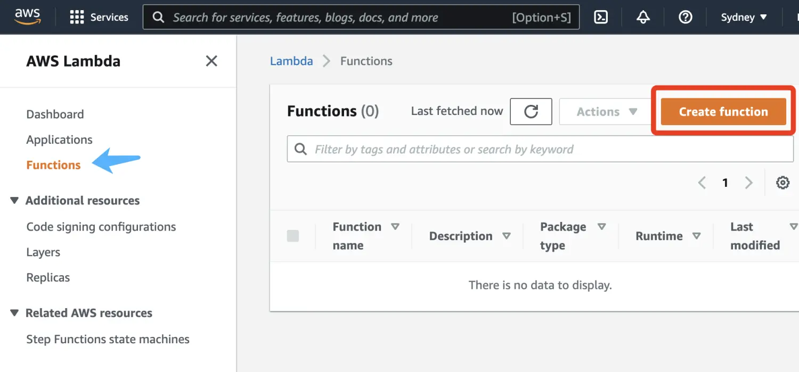
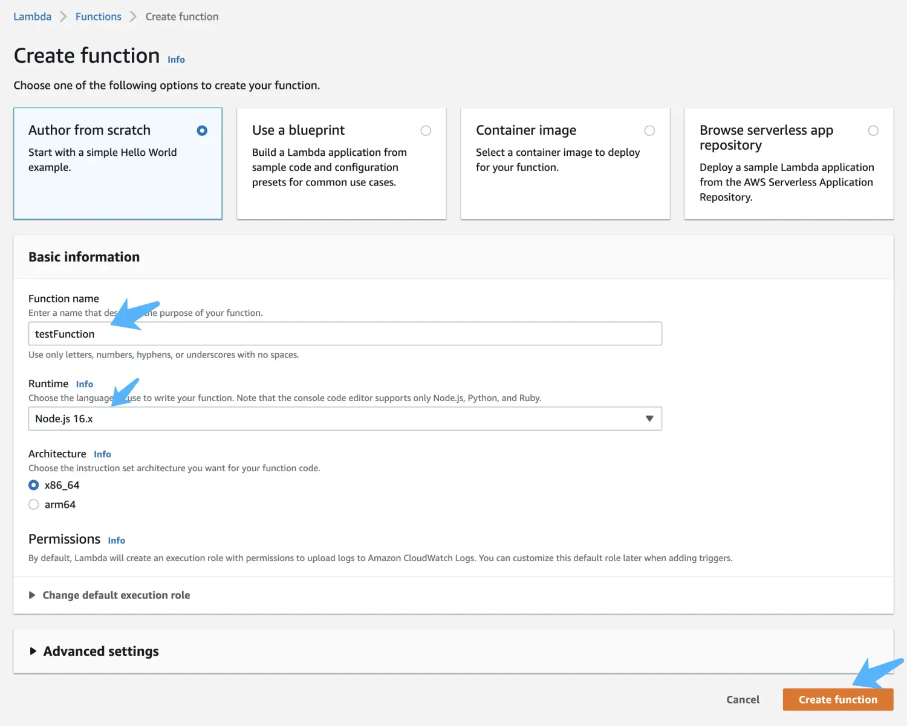
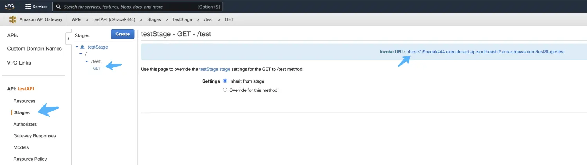

# Serverless

**lastUpdated: 2023-8-23**

## 什么是Serverless

看了很多关于Serverless的介绍，大部分是绑定云厂商来介绍的，顺便介（tui）绍（xiao）了某个云厂商的Serverless服务，所以介绍起来动机不是特别纯。这里不绑定云厂商介绍一下，Serverless是一种无服务器运算的方法，为什么说是无服务器呢？因为在传统的服务中，我们都是用服务器作为载体，部署了一个或者多个服务，以此来提供api等服务给客户端。因此在服务器上我们需要配置很多东西：语言、框架、环境、负载均衡等等，需要进行系统地学习、实践才能精通这些技术。

为了简化这些部署，Serverless就诞生了，开发者只需要写出逻辑代码，后面的事情都交给Serverless来完成，比如需要高并发，Serverless可以自动帮你弹性伸缩，比如搭建语言环境：java、node.js、golang等等，只需要在初始化Serverless的时候去选择即可，后面搭建的事情全权交给Serverless去做就好。因此Serverless可以帮助开发者，帮助软件团队减少在服务器上耗费的时间，做到更加智能、更加简便的运维。

现在各个云厂商都开发了一套Serverless的服务，可以根据需求选择对应的云厂商，在开源社区中，有一套serverless框架，适用于各个云厂商的Serverless服务，包括AWS(亚马逊云)、Google Cloud、Azure(微软云)、阿里云、腾讯云等，后面的文章我会结合Serverless框架讲解如何进行开发与相应的部署工作。
## AWS的Serverless服务 - Lambda

在AWS中，负责Serverless的服务叫做Lambda，下面一步步手动操作来讲解Lambda的使用方法。

### 登陆AWS控制台

进入AWS官网后，点击右上角登陆按钮，输入用户名和密码后登陆进入Dashboard

### 进入Lambda服务

搜索Lambda服务,并进入

### 创建Lambda函数

### 选择从模版创建

输入函数名称，选择语言环境，点击创建即可

创建后里面的环境就自带相应的语言，这里以Node16为例

### 编辑代码

由于是模版创建的，所以会自带一些示例代码，尝试把返回的Hello from Lambda改为Hello World

### 测试

点击测试，即可看到返回值

### 创建API Gateway

为了让外面可以调用这个Lambda函数，我们需要配置AWS的API Gateway，找到API Gateway服务

点击APIs，选择REST API的Build按钮

选择New API模式，输入API的名称，点击Create API

### 创建资源和方法

在/路由下选择创建资源

在资源下创建方法

选择映射到刚刚创建好的Lambda函数

即可完成资源和方法的创建

### 部署API Gateway

在方法上点击部署API

切换到Stage选项卡，即可看到部署好的API Gateway

可以看到右侧有个链接，在Postman调用这个链接即可通过API Gateway调用Lambda函数

### 修改代码后

比如将返回的hello world改为hello lambda，点击部署即可马上调用到最新的接口

Postman查看到最新的接口

<!-- README.md -->
## Comment area

<Vssue />